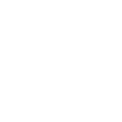

# Hi there, I'm Ahmed Ismail - aka somaa 👋

## I'm a Developer and Masters Student!

-   🔭 I'm currently a masters student at ASU (MSE in Software Engineering)
-   🌱 I’m currently learning
    [Advanced Full-Stack Web Development](https://egfwd.com/specializtion/web-development-advanced/)
-   👯 I’m looking to collaborate in open source projects
-   🥅 2022 Goals: Master JavaScript, TypeScript, Node & Unit Testing
-   ⚡ Fun fact: I love to watch football and read about new tech

### Connect with me:

#### Social Media

 
 

#### Problem Solving

 
 

#### Blogging & Other

 
 

### Languages and Tools:

#### Currently learning and using

 
 

#### Familiar with (used multiple times)

 
 

#### On my wish list

 
 

---

### 📝 Latest Blog Posts

<!-- BLOG-POST-LIST:START -->
- [How Does The Internet Work? Part 3: Traceroute](https://dev.to/ahmedsomaa/how-does-the-internet-work-part-3-traceroute-2b7l)
- [How Does The Internet Work? Part 2: Breaking a Website](https://dev.to/ahmedsomaa/how-does-the-internet-work-part-2-breaking-a-website-5e59)
- [How Does The Internet Work? Part 1: Browsing a Website](https://dev.to/ahmedsomaa/how-does-the-internet-works-part-1-behind-the-scenes-4d6m)
<!-- BLOG-POST-LIST:END -->

---

### ✨ Recent Activity

<!--RECENT_ACTIVITY:start-->
1. 💬 Commented on [#1](https://github.com/ahmedsomaa/ahmedsomaa/pull/1#issuecomment-1242710063) in [ahmedsomaa/ahmedsomaa](https://github.com/ahmedsomaa/ahmedsomaa)
2. ⬆️ Pushed 8 commit(s) to [ahmedsomaa/ahmedsomaa](https://github.com/ahmedsomaa/ahmedsomaa)
3. ⬆️ Pushed 2 commit(s) to [ahmedsomaa/ahmedsomaa](https://github.com/ahmedsomaa/ahmedsomaa)
4. 💪 Opened PR [#1](https://github.com/ahmedsomaa/ahmedsomaa/pull/1) in [ahmedsomaa/ahmedsomaa](https://github.com/ahmedsomaa/ahmedsomaa)
5. ⬆️ Pushed 1 commit(s) to [ahmedsomaa/ahmedsomaa](https://github.com/ahmedsomaa/ahmedsomaa)
<!--RECENT_ACTIVITY:end-->

<!--RECENT_ACTIVITY:last_update-->
Last Updated: Saturday, September 10th, 2022, 1:30:52 PM
<!--RECENT_ACTIVITY:last_update_end-->

---

  
:trophy: GitHub Trophy

  
:zap: GitHub Profile Stats

    
:fire: GitHub Streak Status

  
:computer: Top Skills

